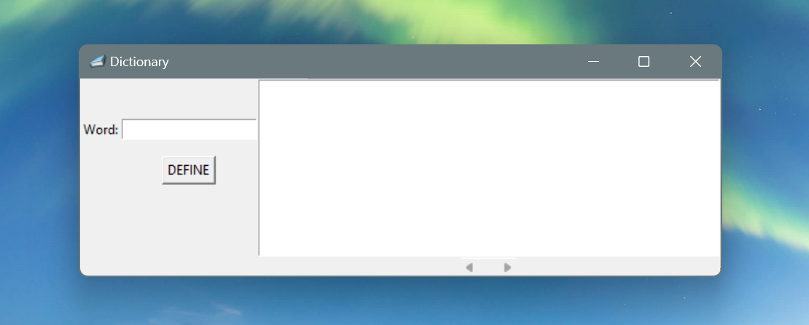
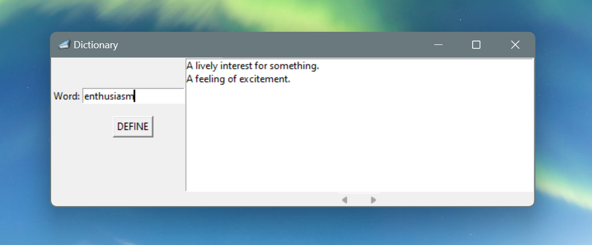

# Mini Dictionary

 
 

<table>
  <tr>
    <td></td>
    <td></td>
  </tr>
</table>
 

 

<b>A Mini Dictionary app that provide the meaning or definition of words</b>

 

## ➡️ Description
This is a Dictionary app for searching the definition of words built with python using the GUI package Tkinter. 
Built this app while learning GUI development using python and extracting data from a json file 
The application was converted to an executable file (.exe) using the pyinstaller package. 

## ➡️ Features
* The dictionary is able to provide multiple definitions of searched words as stored in the json file
* The input field is case insensitive
* Programmed to suggest possible corrections if a word is misspelt
  

## ➡️ Languages | Technologies

<table>
  <tr>
    <td>Programming Languages</td>
    <td>Python</td>
  </tr>
  <tr>
    <td>Frameworks</td>
    <td>Tkinter</td>
  </tr>
</table>
 

## ➡️ Installation
* Clone or download this repository

Method 1
* Open the dist folder and run minidictionary.exe

Method 2
* Ensure python is installed on your system
* Run python minidictionary.py